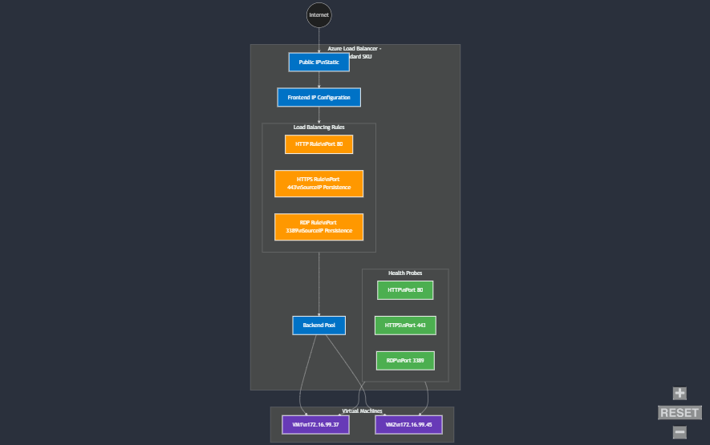

### Motivation

A third-party use a jumphost which is hosted within Azure.  From time to time, one of the Workstations crash due to resource contention resulting in third-party team members being unable to reach various fleets.  The goal of this project is to add a LoadBalancer in front of the machines meaning that if we lost a machine, we can fail over to the secondary machine.  Below are the steps to get up and running with this project.

Note:  Everything below can also be completed the click-ops way within the Azure UI.  Terraform was used in this case because I'm comfortable with managing infrastructure this way, but this is by no means a blocker for this task.

### Architecture

Although I have probs and rules for `80` (_HTTP_) and `443` (_HTTPS_) highlighted in the diagram, only port `3389` (_RDP_) is being used for this exercise.  If these ports are required, copy the `azurerm_lb_probe` and `azurerm_lb_rule` and adjust the port number(s).



### Getting Started

Follow the below steps to get started.

####  Installing the Azure CLI

Install the CLI using the below method.  More information can be found [here](https://learn.microsoft.com/en-us/cli/azure/install-azure-cli-linux?pivots=apt#install-azure-cli).  Avoid using `sudo` to install otherwise you'll need to use `sudo` for every command afterward.

```
curl -sL https://aka.ms/InstallAzureCLIDeb | sudo bash
```

#### Authenticating with the Azure Portal

Once you've the CLI installed, you need to authenticate with Azure to be able to use the Terraform provider.  Since Nomad is using managed accounts, we can't use the normal `az login --use-device-code` as authentication will fail: -

```bash
az login --scope https://graph.microsoft.com/.default
```

It'll provide a code like below, vist the URL and enter it: -
`[To sign in, use a web browser to open the page https://microsoft.com/devicelogin and enter the code DN6LXB33F to authenticate.](https://login.microsoftonline.com/organizations/oauth2/v2.0/authorize?client_id=04b07795-8ddb-461a-bbee-02f9e1bf7b46&response_type=code&redirect_uri=http%3A%2F%2Flocalhost%3A35305&scope=https%3A%2F%2Fgraph.microsoft.com%2F.default+offline_access+openid+profile&state=iMGtxCVYczFgTsbh&code_challenge=9iB3FJ2Yt5mZsnBMet_U15HtRE86z-CB_P1kdDGzJWk&code_challenge_method=S256&nonce=dd84190207ffcacfac52dbdae3f47790cb89a05f8cbf66bb4873bffb4ba6bb52&client_info=1&claims=%7B%22access_token%22%3A+%7B%22xms_cc%22%3A+%7B%22values%22%3A+%5B%22CP1%22%5D%7D%7D%7D&prompt=select_account)`

It'll then show you the available tenants within Azure, just hit `enter`: -

```bash
[Tenant and subscription selection]

No     Subscription name                     Subscription ID                       Tenant
-----  ------------------------------------  ------------------------------------  ---------------------
[1] *  Lumon - SoftCat Azure Cloud Subscrip  e37e02ad-a7fc-481d-b432-xxxxxxxxxxxx  Lumon Limited

The default is marked with an *; the default tenant is 'Lumon Limited' and subscription is 'Lumon - SoftCat Azure Cloud Subscription' (e37e02ad-a7fc-481d-b432-1931018a80b2).

Select a subscription and tenant (Type a number or Enter for no changes):
```

Verify that your account has been loaded: -

```bash
az account list
[
  {
    "cloudName": "AzureCloud",
    "homeTenantId": "e0db078b-c381-439d-825c-xxxxxxxxxxxx",
    "id": "e37e02ad-a7fc-481d-b432-xxxxxxxxxxxx",
    "isDefault": true,
    "managedByTenants": [],
    "name": "Lumon - SoftCat Azure Cloud Subscription",
    "state": "Enabled",
    "tenantDefaultDomain": "lumon.com",
    "tenantDisplayName": "Lumon Limited",
    "tenantId": "e0db078b-c381-439d-825c-xxxxxxxxxxxx",
    "user": {
      "name": "liam.robson@lumon.com",
      "type": "user"
    }
  }
]
```
#### Terraform Init

Now you've logged in, run `terraform init` to pull in the Azure Resource Manager provider and store it within `.terraform` and produce a `.terraform.lock.hcl` file.

#### Terraform Plan

Once you've your resources etc setup, we can run `terraform plan --out=tfplan.out` to issue a dry-run against the provider.  The output will show what will happen: -
  - `+` ~ is adding a resoruce
  - `-` ~ is deleting a resource
  - `~` ~ is modifying an exisiting resource

#### Terraform Apply

Running `terraform apply tfplan.out` runs the code with a molly-guard, to confirm, hit yes if all looks good.  If this is the first run, there will be no `terraform.tfstate` file meaning that the resources you're wanting to add will be created.  If there is a `terraform.tfstate` file, the apply command will query the state file and add, modify or delete resources it manages.

Applying the config seems to take an age, no idea why this is currently: -

```bash
data.azurerm_network_interface.ws2_nic: Read complete after 6m39s [id=/subscriptions/e37e02ad-a7fc-481d-b432-1931018a80b2/resourceGroups/ND-AVD-deployment/providers/Microsoft.Network/networkInterfaces/Workstation-2-nic]
data.azurerm_network_interface.ws1_nic: Read complete after 6m39s [id=/subscriptions/e37e02ad-a7fc-481d-b432-1931018a80b2/resourceGroups/ND-AVD-deployment/providers/Microsoft.Network/networkInterfaces/Workstation-1-nic]
```

#### Terraform Destory

Now that we're managing the below resources, we can remove all resources if/when they are no longer required.  Run `terraform destroy` and this will list all resouces to be destoryed, confirm with `yes`.  Unless you know what it is that's being removed, refrain from using `--auto-approve`.  Using this could make your day slightly worse than it already is.

#### Resources Used

- [Claude AI](https://claude.ai)
- [azurerm_public_ip](https://registry.terraform.io/providers/hashicorp/azurerm/latest/docs/resources/public_ip)
- [azurerm_lb](https://registry.terraform.io/providers/hashicorp/azurerm/latest/docs/resources/lb)
- [azurerm_lb_backend_address_pool](https://registry.terraform.io/providers/hashicorp/azurerm/latest/docs/resources/lb_backend_address_pool)
- [azurerm_lb_probe](https://registry.terraform.io/providers/hashicorp/azurerm/latest/docs/resources/lb_probe.html)
- [azurerm_lb_rule](https://registry.terraform.io/providers/hashicorp/azurerm/latest/docs/resources/lb_rule)
- [azurerm_network_interface_backend_address_pool_association](https://registry.terraform.io/providers/hashicorp/azurerm/latest/docs/resources/network_interface_backend_address_pool_association)

#### Considerations

- It's best practice to not store `terraform.tfstate` in source control, I.e. Git for a number of reasons.  It's best practice to store the state file within a remote state storage account within Azure.  I didn't get around to this but be aware, *if you are using this project and another one of your colleagues is also using it, the state between you and him/her could cause issues when applying/destroying*.
- 